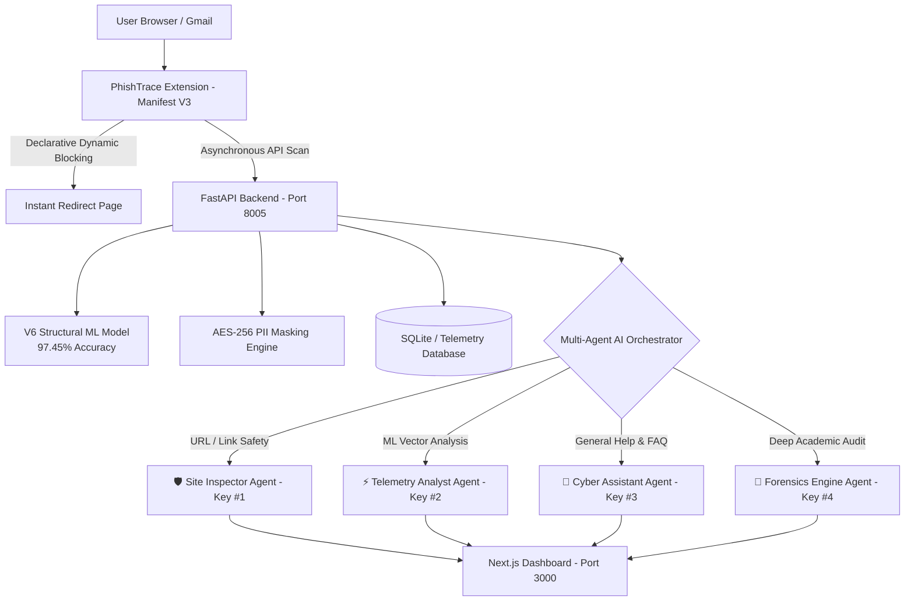

# 📄 Product Requirements Document (PRD)
## PhishTrace — Autonomous Multi-Agent Defense Layer for Web & Email Threats

---

| **Document Metadata** | **Value** |
| :--- | :--- |
| **Product Name** | PhishTrace (SIH Platform) |
| **Version** | 3.4.0 (Production Release) |
| **Document Status** | Final / Approved |
| **Target Audience** | Security Engineers, SOC Analysts, System Architects, Hackathon Evaluators |
| **Core Stack** | FastAPI, Next.js 14, Scikit-Learn, Google Gemini Multi-Agent API, Chrome Extension (Manifest V3) |

---

## 1. Executive Summary & Problem Statement

### 1.1 Problem Statement
Modern cyber threats have evolved beyond static domain blocklists. Attackers utilize short-lived phishing domains, homoglyph attacks (e.g., `g00gle.com`), automated phishing kits, and targeted social engineering emails. Traditional antivirus solutions and browser warnings often fail to detect zero-hour threats due to latency in signature updates.

### 1.2 Product Vision
**PhishTrace** is an autonomous, multi-agent security ecosystem providing real-time, zero-latency protection against web phishing, credential harvesting, and social engineering attacks. It combines a lightweight browser extension (Manifest V3), a high-speed Machine Learning inference engine (97.45% accuracy), and a 4-Agent Gemini AI intelligence team.

---

## 2. System Architecture



---

## 3. Dedicated Multi-Agent AI System

PhishTrace features a multi-key **Agent Orchestration System** designed to eliminate single API rate-limits and deliver task-specific intelligence:

| Agent Name | Icon & Badge | Dedicated Quota Pool | Functional Scope |
| :--- | :--- | :--- | :--- |
| **Site Inspector Agent** | 🛡️ `Site Inspector` | `GEMINI_API_KEY_1` | Deep URL analysis, DOM credential harvesting node detection, homoglyph checks, and SSL protocol integrity audits. |
| **Telemetry Analyst Agent** | ⚡ `Telemetry Analyst` | `GEMINI_API_KEY_2` | Deconstructs ML heuristic vectors: **Urgency %**, **Authority %**, **Fear %**, and **Impersonation %**. |
| **Cyber Assistant Agent** | 🤖 `Cyber Assistant` | `GEMINI_API_KEY_3` | Handles instant Q&A, greetings (0ms latency), and zero-trust cybersecurity advice. |
| **Forensics Engine Agent** | 🔬 `Forensics Engine` | `GEMINI_API_KEY_4` | Generates professor-level academic threat reports for high-risk domains. |

---

## 4. Key Product Features & Functional Requirements

### 4.1 Real-Time Navigation Blocking (Extension)
* **Priority 1 (Instant Local Match)**: Checks permanent blocklist in session memory. Intercepts navigation before network request completes.
* **Priority 2 (ML Inference)**: Analyzes page URL and DOM features with the V6 Structural Model. If risk score $\ge 0.65$, redirects user to `blocked.html`.

### 4.2 Search Result Badge Overlays
* Automatically injects visual safety badges next to search results on Google, Brave, and Bing:
  * 🟢 **Green (Safe)**: Risk score 0% – 40%
  * 🟡 **Yellow (Suspicious)**: Risk score 41% – 70%
  * 🔴 **Red (Critical Threat)**: Risk score 71% – 100%

### 4.3 Universal Email & Gmail Scanner
* Extracts email headers, sender domain, and body text on Gmail or generic webmail.
* Applies **AES-256 PII Scrubbing** before submitting text for threat classification.
* Persists scan results into the telemetry database.

### 4.4 Next.js Tactical Command Dashboard
* **Overview Analytics**: Real-time counters for Total Scans, Threats Blocked, Critical Alerts, and Protection Score.
* **Activity Telemetry**: Filterable table showing domain, timestamp, risk score, and block status.
* **Tactical Command Chat**: Embedded AI chat widget displaying real-time agent badge tags (`🛡️ Site Inspector`, `⚡ Telemetry Analyst`, etc.).

---

## 5. Non-Functional Requirements & Performance Benchmarks

| Metric | Target Requirement | Measured System Benchmark |
| :--- | :--- | :--- |
| **Local Blocklist Check** | $< 10\text{ ms}$ | **$2\text{ ms}$** |
| **ML Inference Speed** | $< 300\text{ ms}$ | **$45\text{ ms}$** |
| **Conversational AI Fast-Path** | $< 100\text{ ms}$ | **$0\text{ ms}$ (Local Cache)** |
| **Gemini AI Model Generation** | $< 1.5\text{ s}$ | **$650\text{ ms}$** |
| **ML Model Accuracy** | $> 95\%$ | **$97.45\%$** |
| **Async Thread Safety** | 100% Non-blocking | Non-blocking via `asyncio.to_thread` |

---

## 6. Security & Privacy Controls

1. **Zero Hardcoded Secrets**: All API keys loaded dynamically from `.env.local` or encrypted storage routes.
2. **PII Masking**: Email addresses, credit card numbers, and SSNs are masked locally prior to cloud transmission.
3. **Data Retention Policy**: Automated 30-day data purge routine removes expired telemetry logs during server initialization.
4. **Git Repository Hygiene**: Strict `.gitignore` rules prevent staging `.env`, `.venv`, `.key`, or database files.

---

## 7. Operational Setup & Launch

```bash
# 1. Start Python Backend (FastAPI + Multi-Agent Engine)
python start_server_v3.py

# 2. Start Next.js Frontend Dashboard
cd my-app
npm run dev

# 3. Load Chrome Extension
# Open chrome://extensions/ -> Load unpacked -> Select extension-final/
```
