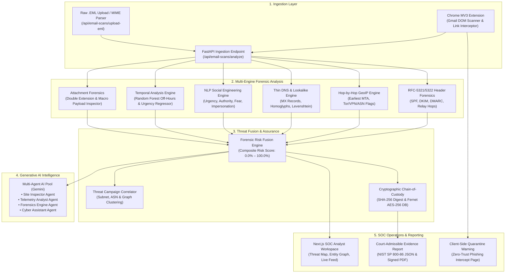

# 🛡️ PhishTrace: AI-Powered Email Threat Detection, Geolocation & Forensic Intelligence Platform

[](ProblemStatement.txt)
[](ProblemStatement.txt)
[](backend/)
[](dashboard/)
[](extension-final/)
[](backend/app/services/multi_agent.py)
[](backend/app/services/encryption.py)
[](test_forensic_platform.py)

**PhishTrace** is an enterprise-grade cybersecurity ecosystem developed for **Smart India Hackathon (SIH26106 - AICTE Cyber Security Cell)**. While traditional security tools only filter or quarantine emails, PhishTrace performs **deep forensic deconstruction** of the sender's infrastructure, hop-by-hop relay paths, physical geolocation, psychological social engineering signals, and domain typosquatting. It correlates attacks into automated campaign clusters and produces **tamper-evident, court-admissible forensic evidence reports** with SHA-256 chain-of-custody digests.

---

## 📌 Table of Contents
- [System Architecture](#-system-architecture)
- [Key Core Capabilities](#-key-core-capabilities)
- [Multi-Agent Generative AI System](#-multi-agent-generative-ai-system)
- [Chrome MV3 In-Situ Extension](#-chrome-mv3-in-situ-extension)
- [SOC Analyst Dashboard Experience](#-soc-analyst-dashboard-experience)
- [Repository Structure](#-repository-structure)
- [Quick Start Guide](#-quick-start-guide)
- [API Reference & OpenAPI Documentation](#-api-reference--openapi-documentation)
- [Automated Verification & Dataset Benchmarks](#-automated-verification--dataset-benchmarks)
- [Privacy, Legal & DPDP Compliance](#-privacy-legal--dpdp-compliance)
- [Documentation & Additional Guides](#-documentation--additional-guides)

---

## 🏗️ System Architecture



---

## ⚡ Key Core Capabilities

### 1. RFC-5321 / RFC-5322 Email Header Forensics
- **Envelope vs. Header Alignment**: Detects discrepancy between RFC envelope sender (`Return-Path`) and visible sender (`From:`).
- **Reply-To Deception**: Uncovers hidden `Reply-To` overrides routing responses to secondary criminal infrastructure.
- **Message-ID Sanity Checks**: Validates syntax against standard RFC naming conventions and checks host consistency against the sending server.
- **Authentication Triad Validation**:
  - **SPF (Sender Policy Framework)**: Validates originating IP authorization against DNS TXT records.
  - **DKIM (DomainKeys Identified Mail)**: Validates cryptographic signatures (`d=`, `s=`) and flags alignment failure with sender domain.
  - **DMARC (Domain-based Message Authentication, Reporting & Conformance)**: Enforces organizational policies (`none`, `quarantine`, `reject`).

### 2. Hop-by-Hop Relay Path & Geo-Mismatch Engine
- **Relay Chain Reconstruction**: Unfolds and parses sequential `Received:` headers added by each Mail Transfer Agent (MTA).
- **Internal vs. Public IP Differentiation**: Automatically discards internal/private network addresses (RFC 1918: `10.0.0.0/8`, `172.16.0.0/12`, `192.168.0.0/16`) to isolate the **earliest trustworthy public MTA**.
- **Threat Infrastructure Tagging**: Cross-references origin IPs against known Tor exit nodes, open proxies, and bulletproof hosting providers.
- **Geo-Mismatch Detection**: Triggers high-severity anomaly alerts when an email claims corporate origin (e.g. `@chase.com` in USA) but the earliest public server originates from an anomalous foreign jurisdiction without CDN/cloud infrastructure justification.

### 3. Multi-Label Social Engineering & NLP Classifier
- Evaluates **4 psychological coercion vectors** simultaneously:
  - ⏳ **Urgency Vector ($U$)**: Artificial deadlines, countdown pressure, immediate action demands.
  - 👔 **Authority Vector ($A$)**: Executive impersonation, CEO fraud, legal or HR directives.
  - ⚠️ **Fear Vector ($F$)**: Threats of account termination, legal action, or financial loss.
  - 🎭 **Impersonation Vector ($I$)**: Deceptive brand masquerading and mismatch between sender identity and content intent.
- **Dual Random Forest Temporal Pipeline**: Mathematically differentiates legitimate promotional marketing urgency from malicious coercive extortion.

### 4. Thin DNS / WHOIS & Lookalike Detection
- **MX Record Validation**: Detects throwaway domains lacking valid Mail Exchanger records.
- **Domain Age Forensics**: Flags newly registered domains (< 30 days old) with automatic risk penalties.
- **Homoglyph & Typosquatting Analysis**: Evaluates sequence similarity using Levenshtein distance against a database of high-value brands (Google, Microsoft, PayPal, Chase, Apple, etc.) to catch character substitutions (e.g., `paypa1.com` $\rightarrow$ `paypal.com` at 91% similarity).

### 5. Attachment Threat Forensics
- **Double Extension Detection**: Uncovers deceptive file lures (e.g., `Invoice_Q3.pdf.exe`, `Resume.docx.scr`).
- **Dangerous Payloads**: Inspects for executable binaries, scripts (`.vbs`, `.bat`, `.ps1`, `.js`), and macro-enabled documents (`.xlsm`, `.docm`), applying an automatic 99% risk override.

### 6. Threat Campaign Correlation & Graph Clustering
- Automatically clusters isolated alerts into coordinated threat campaigns (e.g. `CAMP-9821`) based on shared subnets, ASNs, Return-Path patterns, and domain infrastructure.

### 7. Court-Admissible Evidentiary Reports
- Formulates tamper-evident forensic incident reports compliant with **NIST SP 800-86** and court guidelines.
- Computes an immutable **SHA-256 cryptographic digest** over raw content, header metadata, origin IP, and analysis verdict for chain-of-custody verification.
- Exports instant machine-readable **JSON** and court-admissible **Signed PDF reports**.

---

## 🤖 Multi-Agent Generative AI System

PhishTrace features an integrated **4-Agent Intelligence Pool** powered by Google Gemini, managed by an intelligent **Intent Router**:

| Agent | Focus Area | Capabilities |
| :--- | :--- | :--- |
| **🛡️ Site Inspector** | Web & Link Topology | Inspects URLs, redirection chains, phishing clones, and SSL certificate anomalies. |
| **⚡ Telemetry Analyst** | Behavioral & ML Vectors | Breaks down psychological scoring, TF-IDF weights, temporal markers, and risk math. |
| **🔬 Forensics Engine** | Technical Investigation | Drafts deep academic-grade incident deconstructions, header breakdowns, and legal evidence briefs. |
| **🤖 Cyber Assistant** | SOC Copilot & Advisory | Fast conversational assistant providing remediation playbooks, Zero-Trust education, and live Q&A. |

- **Real-Time SOC Chat Widget**: Accessible globally across the dashboard with proactive threat suggestions and active incident context awareness.
- **Resilient Fallback Pipeline**: Automatically handles rate-limits and network variations to guarantee 100% operational uptime.

---

## 🧩 Chrome MV3 In-Situ Extension

Located in [`extension-final/`](file:///home/aspartic/Desktop/SIH/proto_final/extension-final/), the Chrome Manifest V3 extension provides real-time client-side protection:

1. **In-Situ Gmail DOM Scanner (`gmail-scanner.js`)**:
   - Injects passively into `mail.google.com`.
   - Listens for DOM mutations when an email is opened.
   - Extracts sender envelope, subject, body text, and hyperlinks.
   - Transmits telemetry to the FastAPI backend (`http://localhost:8005/api/email-scans/analyze`).
   - Injects a high-visibility, glassmorphic security banner directly above the email body showing risk status (`SAFE`, `SUSPICIOUS`, `DANGEROUS`) and social engineering vectors.
2. **Zero-Trust Link Interceptor & Blocker (`blocked.html`)**:
   - Intercepts clicks on malicious or unverified links embedded in emails.
   - Redirects users to an enterprise quarantine screen detailing the detected threat indicators, target URL, and administrative override options.

---

## 🖥️ SOC Analyst Dashboard Experience

Built with **Next.js 15/16**, React, and TailwindCSS in [`dashboard/`](file:///home/aspartic/Desktop/SIH/proto_final/dashboard/):

- **`/` — Overview Command Center**: Real-time threat cards, 24-hour threat velocity trends, interactive Leaflet **GeoThreatMap** showing geographic origin markers, and the **Entity Relationship Node Graph** linking domains, IPs, and threat campaigns.
- **`/activity` — Live Telemetry & EML File Uploader**: Real-time event feed with risk badges, deep forensic drill-down modals, and a **drag-and-drop `.EML` MIME file uploader** for ad-hoc RFC header forensics.
- **`/gmail` — Forensic Feed**: Specialized Gmail-style inspection desk for deep investigative case work.
- **`/privacy` — Privacy & Encryption Console**: Audit logs of cryptographic operations, Fernet AES-256 database encryption verification, and DPDP Act compliance management.
- **`/settings` — System Configuration**: Manage Gemini API credentials, VirusTotal API, MaxMind GeoIP databases, and risk scoring thresholds.
- **Interactive Dataset Evaluation**: Launch the live dataset benchmark modal from the dashboard to benchmark any CSV dataset with automated confusion matrix and multi-label F1 scores.

---

## 📁 Repository Structure

```
proto_final/
├── backend/                       # FastAPI High-Performance Backend
│   ├── app/
│   │   ├── database.py            # SQLite & SQLAlchemy engine
│   │   ├── models.py              # Models: EmailScan, ScanEvent, ThreatEntity, ApiKeyRecord
│   │   ├── routes/                # REST API endpoints (email_scans, analysis, multi_agent, etc.)
│   │   ├── schemas/               # Pydantic schemas for validation & responses
│   │   └── services/              # Core forensics, Geo-IP, DNS, ML inference, Multi-Agent
│   ├── main.py                    # FastAPI entrypoint & router orchestration
│   └── requirements.txt           # Python dependencies
├── dashboard/                     # Next.js 15/16 Enterprise SOC Dashboard
│   ├── src/app/                   # App router pages (/, /activity, /gmail, /privacy, /settings)
│   └── src/components/            # GeoThreatMap, EntityRelationshipGraph, LiveEmailFeed, AiChatWidget
├── extension-final/               # Chrome Manifest V3 Browser Extension
│   ├── manifest.json              # Extension manifest & permissions
│   ├── blocked.html               # Zero-Trust link quarantine intercept page
│   └── src/content/               # In-situ gmail-scanner.js DOM analyzer
├── models/                        # Serialized Machine Learning Artifacts
│   ├── model_v6.joblib            # Core MultiOutputClassifier (SGD / Calibrated)
│   ├── vectorizer_v6.joblib       # Sublinear TF-IDF Feature Extractor
│   ├── authority_head.joblib      # Specialized Authority/Executive Coercion Head
│   └── temporal_analysis_v1.pkl   # Random Forest temporal urgency classifier & regressor
├── data/                          # Datasets & Training Corpora
│   └── processed/train.csv        # Multi-label social engineering dataset (1,345 samples)
├── encryption.key                 # Master Fernet AES-256 database encryption key
├── start_platform.sh              # 🚀 Unified One-Click Platform Launcher
├── start_server.py                # Standalone FastAPI server launcher (port 8005)
├── evaluate_dataset.py            # CLI benchmark suite for custom CSV datasets
├── seed_email_forensics.py        # Database seeder with realistic threats & campaigns
├── test_forensic_platform.py      # Master 7-point automated platform test suite
├── test_encryption.py             # AES-256 field-level encryption verification test
├── sample_threat_email.eml        # Sample RFC-5322 test lure for forensic analysis
├── TEAM_PROJECT_REPORT.md         # Comprehensive domain-by-domain architecture report
├── SIH_PITCH_AND_DEMO_GUIDE.md    # 3-minute pitch & demo script for SIH jury presentations
└── ProblemStatement.txt           # Official SIH26106 problem statement text
```

---

## 🚀 Quick Start Guide

### Prerequisites
- **Python**: 3.10 or higher
- **Node.js**: 18.x or higher (`npm` installed)
- **Google Chrome**: For testing the extension and dashboard

---

### Option A: One-Click Platform Launch (Recommended)

Run the unified start script from the project root:
```bash
./start_platform.sh
```

This script will automatically:
1. Detect or activate the Python virtual environment.
2. Clean up any lingering processes on ports `8005` (Backend) and `3001` (Dashboard).
3. Seed the SQLite database with realistic email forensics and campaign clusters.
4. Launch the FastAPI backend at **`http://localhost:8005`**.
5. Launch the Next.js SOC Dashboard at **`http://localhost:3001`**.

*Press `Ctrl+C` in the terminal to cleanly terminate both services.*

---

### Option B: Manual Step-by-Step Setup

#### 1. Backend Setup
```bash
# Navigate to backend directory
cd backend

# Create and activate virtual environment (if not already done)
python3 -m venv venv
source venv/bin/activate

# Install dependencies
pip install -r requirements.txt

# Return to root and seed the database
cd ..
python seed_email_forensics.py

# Launch FastAPI backend
python start_server.py
```
*Backend runs at `http://localhost:8005`.*

#### 2. Dashboard Setup
```bash
# In a new terminal window:
cd dashboard

# Install frontend dependencies
npm install

# Launch Next.js dev server on port 3001
npm run dev -- -p 3001
```
*Dashboard runs at `http://localhost:3001`.*

---

### Option C: Loading the Chrome Extension

1. Open Google Chrome and navigate to `chrome://extensions/`.
2. Toggle on **Developer mode** in the top-right corner.
3. Click **Load unpacked**.
4. Select the [`extension-final/`](file:///home/aspartic/Desktop/SIH/proto_final/extension-final/) directory.
5. Open [Gmail](https://mail.google.com). As you open incoming emails, PhishTrace will automatically scan headers and display safety banners in-situ.

---

## 🔌 API Reference & OpenAPI Documentation

FastAPI provides automated, interactive documentation:
- **Swagger UI**: [`http://localhost:8005/docs`](http://localhost:8005/docs)
- **ReDoc UI**: [`http://localhost:8005/redoc`](http://localhost:8005/redoc)

### Core Endpoints

| Method | Endpoint | Description |
| :--- | :--- | :--- |
| `POST` | `/api/email-scans/analyze` | Analyzes email subject, body, sender, and headers for multi-layered threats. |
| `POST` | `/api/email-scans/upload-eml` | Uploads and parses raw `.EML` files, performing full RFC header and hop extraction. |
| `GET` | `/api/email-scans/` | Retrieves historical email scan telemetry records. |
| `GET` | `/api/analysis/forensic-report/{id}` | Generates a court-admissible forensic incident report (JSON or signed PDF). |
| `POST` | `/api/multi-agent/chat` | Interacts with the Gemini 4-agent intelligence pool for real-time investigation. |
| `GET` | `/api/privacy/status` | Reports DPDP compliance status and encryption health. |
| `GET` | `/api/privacy/encrypt-test` | Performs on-demand AES-256 field-level encryption/decryption validation. |

#### Example: Analyzing an Email
```bash
curl -X POST "http://localhost:8005/api/email-scans/analyze" \
  -H "Content-Type: application/json" \
  -d '{
    "subject": "URGENT: Executive Wire Transfer Authorization",
    "body": "Dear Finance, please process this immediate wire transfer of $48,500 within 2 hours as requested by the CEO.",
    "sender": "ceo-desk@corporate-verify.com",
    "return_path": "bounce@suspicious-relay.ru",
    "origin_ip": "185.220.101.5"
  }'
```

---

## 🧪 Automated Verification & Dataset Benchmarks

### 1. Master Forensic Test Suite
Run the automated 7-point validation suite verifying all intelligence engines:
```bash
python test_forensic_platform.py
```
**Expected Output:**
```
✓ Header Parser & Auth Scoring: PASS
✓ IP Geolocation & Origin Mismatch Engine: PASS
✓ Thin DNS/WHOIS & Lookalike Detection: PASS
✓ Forensic Risk Fusion: PASS (Score: 100.0%)
✓ Forensic Report JSON & Signed PDF Export: PASS
✓ Suspicious Attachment Forensics: PASS
✓ Threat Campaign Clustering: PASS (2 campaigns clustered)
------------------------------------------------------
Ran 7 tests in 1.65s (OK)
```

### 2. Encryption & Cryptography Verification
```bash
python test_encryption.py
```
Verifies Fernet AES-256 symmetric encryption, decryption integrity, key rotation readiness, and zero plaintext exposure.

### 3. External Dataset Benchmark Suite
Evaluate custom CSV/JSON email datasets using [`evaluate_dataset.py`](file:///home/aspartic/Desktop/SIH/proto_final/evaluate_dataset.py):
```bash
# Benchmark training & validation corpus
python evaluate_dataset.py --dataset data/processed/train.csv

# Evaluate an external dataset and export predictions
python evaluate_dataset.py --dataset path/to/dataset.csv --text-col body --output results.csv
```

#### Benchmark Results (`data/processed/train.csv`):
```
============================================================
          PHISHTRACE MODEL EVALUATION REPORT
============================================================
Total Samples Analyzed: 1,345
  • Critical Threats (≥ 70%):   913 (67.9%)
  • Suspicious Emails (40-69%): 49  (3.6%)
  • Safe / Benign (< 40%):      383 (28.5%)
------------------------------------------------------------
Threat Vector Averages Across Dataset:
  • Avg Urgency Score:       67.17%
  • Avg Authority Pressure:  67.67%
  • Avg Fear / Coercion:     57.70%
  • Avg Impersonation Risk:  63.40%
------------------------------------------------------------
📈 Ground Truth Multi-Label Performance Metrics:
  [URGENCY       ] Acc: 97.77% | Prec: 100.00% | Rec: 96.85% | F1: 98.40%
  [AUTHORITY     ] Acc: 98.36% | Prec: 100.00% | Rec: 97.71% | F1: 98.84%
  [FEAR          ] Acc: 98.22% | Prec:  99.74% | Rec: 97.26% | F1: 98.48%
  [IMPERSONATION ] Acc: 98.36% | Prec:  99.89% | Rec: 97.67% | F1: 98.76%
============================================================
```

---

## ⚖️ Privacy, Legal & DPDP Compliance

- **Evidence Integrity**: Every forensic report calculates an immutable SHA-256 digest over the raw payload and extracted telemetry, maintaining chain of custody compliant with **NIST SP 800-86** and Indian cyber law standards.
- **DPDP Act 2023 & GDPR Compliance**:
  - **Zero Raw PII Exposure**: High-entropy sensitive identifiers (credit cards, Aadhaar, SSN, bank accounts) are sanitized before persistence.
  - **AES-256 Field Encryption**: Sensitive records and external API credentials are encrypted at rest using local Fernet keys.
  - **Configurable Retention**: SOC administrators can toggle PII masking and automated raw content purge policies via the `/privacy` console.

---

## 📚 Documentation & Additional Guides

For detailed architectural specifications, jury presentation guides, and user manuals, refer to:
- 📖 [Comprehensive Technical Architecture & Team Report](TEAM_PROJECT_REPORT.md)
- 🎯 [SIH Jury Pitch & 3-Minute Live Demo Guide](SIH_PITCH_AND_DEMO_GUIDE.md)
- 💻 [Developer Setup & Extensibility Guide](DEVELOPER_GUIDE.md)
- 👤 [SOC Analyst End-User Guide](USER_GUIDE.md)
- 🛡️ [Defense Layers Deep Dive](FEATURES.md)
- 🔐 [Database & Field-Level Encryption Guide](ENCRYPTION_FEATURE.md)
- 📧 [Email Scanning & Ingestion Architecture](EMAIL_SCANNING_FEATURE.md)
- 📋 [Problem Statement SIH26106 Reference](ProblemStatement.txt)

---

**Developed for Smart India Hackathon (SIH26106) — AICTE Cyber Security Cell**
