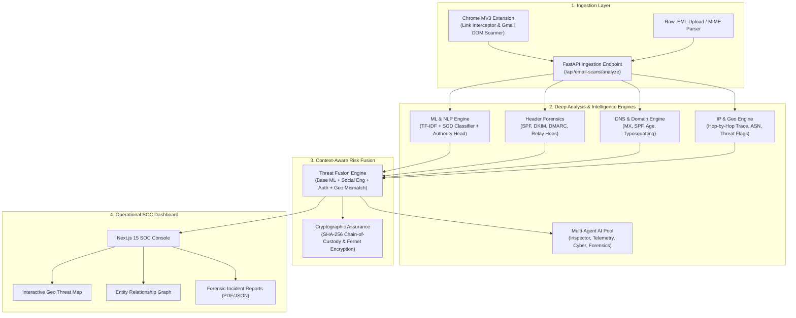

# PhishTrace: AI-Powered Email Threat Detection, Geolocation & Forensic Intelligence Platform
## Comprehensive Domain-Wise Technical Architecture & Teammate Project Report

---

## 1. Executive Summary & Problem Context

### 1.1 Background & The Challenge
Email remains the primary threat vector for modern cybercrime, business email compromise (BEC), spear-phishing, credential harvesting, and financial fraud. Attackers exploit gaps in traditional email defenses using:
- **AI-generated social engineering** (urgency, intimidation, authority impersonation).
- **Domain lookalikes & typosquatting** (`paypa1.com`, `micros0ft.com`).
- **Header & transmission spoofing** (forged `From` headers, mismatched `Reply-To`, manipulated relay chains).
- **Anonymized infrastructure** (bulletproof hosting, compromised proxies, Tor exit nodes).

### 1.2 The SIH Problem Statement
Current email security tools (e.g., standard spam filters, basic blacklists) only **filter or block** emails; they fail to perform **deep forensic tracing** of the sender's true infrastructure, relay path, and geographical origin. Organizations lack the capability to:
1. Reconstruct the full transmission path across intermediate mail servers.
2. Correlate header telemetry, SPF/DKIM/DMARC status, and IP geolocation.
3. Quantify psychological coercion cues (Urgency, Fear, Authority pressure).
4. Preserve a legally admissible, cryptographically signed chain of custody for law enforcement and CERT-In reporting.

### 1.3 The PhishTrace Solution
**PhishTrace** is an end-to-end cyber defense and forensic intelligence ecosystem combining:
- **Chrome MV3 Browser Extension** with an in-situ Gmail DOM Scanner and Zero-Trust link blocker.
- **High-Performance FastAPI Backend** executing multi-stage ML inference, protocol parsing, and DNS/IP intelligence.
- **Multi-Agent Generative AI System** powered by Google Gemini for forensic explanation and interactive investigation.
- **Enterprise SOC Dashboard** built with Next.js 15, interactive Leaflet threat maps, and force-directed entity relationship graphs.
- **Cryptographic Evidence Engine** generating NIST SP 800-86 and DPDP-compliant forensic incident reports with SHA-256 integrity hashes.

---

## 2. High-Level System Architecture & Data Flow



---

## 3. Domain-by-Domain Technical Breakdown

### Domain 1: Machine Learning & NLP Threat Detection Engine
- **Primary Source Files**: `backend/app/services/inference.py`, `models/model_v6.joblib`, `models/vectorizer_v6.joblib`, `models/authority_head.joblib`, `evaluate_dataset.py`, `data/processed/train.csv`

#### Architecture & Model Zoo
The platform uses a tiered, multi-model ensemble to process email subject lines, body text, and structural cues:
1. **Core Classifier (`model_v6.joblib`)**: High-performance linear classifier (SGD with log-loss / CalibratedClassifierCV) trained on extensive labeled phishing and legitimate corpora.
2. **Feature Extractor (`vectorizer_v6.joblib`)**: Word and character n-gram TF-IDF vectorizer (sublinear TF scaling, custom token filters) that captures obfuscated text, deceptive phrasing, and urgent keyword patterns.
3. **Authority Head (`authority_head.joblib`)**: Specialized head detecting executive pressure, impersonation language ("wire immediately", "CEO request", "HR urgent action").
4. **Temporal Analysis Head (`temporal_analysis_v1.pkl`)**: Analyzes email timestamp anomalies, off-hours dispatch patterns, and transmission delays across relay hops.

#### Social Engineering Heuristic Vectors
In addition to categorical classification, the ML engine extracts four calibrated behavioral vectors:
- **Urgency Vector ($U$)**: Measures temporal pressure phrases (*"within 24 hours"*, *"account will be suspended"*).
- **Fear Vector ($F$)**: Identifies coercion, legal threats, or account penalties (*"unauthorized login"*, *"law enforcement action"*).
- **Authority Vector ($A$)**: Quantifies executive or institutional impersonation cues (*"Management Directive"*, *"IT Security Admin"*).
- **Impersonation Vector ($I$)**: Flags mismatch between purported sender identity and content intent.

#### Evaluation & Testing Pipeline
- **Dataset**: `data/processed/train.csv` contains thousands of labeled real-world phishing and legitimate emails.
- **Script**: `evaluate_dataset.py` benchmarks Accuracy, Precision, Recall, F1-Score, and False Positive Rate (FPR), rendering an interactive confusion matrix on the dashboard.

---

### Domain 2: Email Header Forensics & Protocol Authentication
- **Primary Source Files**: `backend/app/services/email_forensics.py`, `backend/app/services/temporal.py`, `sample_threat_email.eml`

#### RFC 5321 / 5322 Deep Header Inspection
The forensics engine parses and validates every key envelope and header field:
- **Return-Path vs. From**: Detects spoofed sender envelopes where bounce-backs route to attacker infrastructure while the user sees a legitimate brand.
- **Reply-To Mismatch**: Identifies deceptive reply routing where replies bypass the display domain to land in an attacker's mailbox.
- **Message-ID Sanity**: Validates syntax against standard RFC conventions and checks domain consistency against the sending server.

#### Authentication Protocol Triad (SPF / DKIM / DMARC)
1. **SPF (Sender Policy Framework)**: Checks whether the originating IP was authorized in the sender domain's DNS TXT records.
2. **DKIM (DomainKeys Identified Mail)**: Inspects `DKIM-Signature` headers, extracts signing domain (`d=`) and selector (`s=`), and verifies cryptographic alignment with the `From` domain.
3. **DMARC (Domain-based Message Authentication, Reporting & Conformance)**: Checks alignment policies (`none`, `quarantine`, `reject`) to determine whether failing emails violate organizational security policies.

#### Hop-by-Hop Relay Path Reconstruction
Email headers contain sequential `Received:` lines added by each mail transfer agent (MTA) along the delivery path:
- The parser cleans RFC line folding, isolates each hop, and extracts the sending host (`from`), receiving host (`by`), transmission protocol (`ESMTPS`), and hop timestamp.
- It differentiates **internal/private IP blocks** (RFC 1918: `10.0.0.0/8`, `172.16.0.0/12`, `192.168.0.0/16`) from **public internet hops**.
- **Origin IP Extraction**: Identifies the earliest reliable public IP address in the chain, discarding trusted internal network hops.
- **Hop Latency Analysis**: Calculates the delta (in seconds) between MTAs to detect deliberate relay delay or intermediate proxy routing.

---

### Domain 3: Network, DNS & Geolocation Threat Intelligence
- **Primary Source Files**: `backend/app/services/dns_analysis.py`, `backend/app/services/ip_geolocation.py`, `backend/app/services/impersonation.py`

#### DNS & Domain Verification
- **MX Record Validation**: Checks whether the sender domain has valid, reachable Mail Exchanger records. Spammers often send from throwaway domains with no MX records.
- **Domain Age Analysis**: Queries WHOIS records to determine domain registration dates. Domains registered within the last 30 days receive an automatic high-risk penalty.
- **DNS Security Signals**: Checks for the existence of published SPF records (`v=spf1`) and DMARC policies (`_dmarc.<domain>`).

#### Typosquatting & Homoglyph Detection
- Compares incoming domains against a protected database of high-value brands (Google, Microsoft, PayPal, Chase, Apple, Bank of America).
- Uses sequence similarity (`difflib.SequenceMatcher`) to catch character substitutions (`paypa1.com` $\rightarrow$ `paypal.com` at 91% similarity) and visual homoglyph lures.

#### IP Geolocation & Threat Attribution
- Resolves the originating IP against geolocation intelligence: Country, City, Coordinates (Latitude/Longitude), ISP, Organization, and Autonomous System Number (ASN).
- **Threat Relay Detection**: Identifies known Tor exit nodes, bulletproof hosting clusters (e.g., Zwiebelfreunde, Selectel threat ranges), and open proxy networks.
- **Geolocation Mismatch Engine**: If an email claims to originate from a regional corporate headquarters (e.g., US or UK) but the earliest public MTA originates from an anomalous jurisdiction without CDN/cloud justification, an automatic anomaly flag is triggered.

---

### Domain 4: Context-Aware Threat Fusion Engine
- **Primary Source Files**: `backend/app/services/email_risk.py`, `backend/app/services/forensic_report.py`

#### Multi-Factor Composite Scoring Formula
PhishTrace does not rely on a single isolated metric. The **Risk Fusion Engine** calculates a composite risk score ($0.0 \text{ to } 1.0$) using weighted behavioral and technical factors:

$$\text{Social Engineering Index} = (0.35 \times U) + (0.35 \times F) + (0.30 \times A)$$

$$\text{Base Risk} = (0.25 \times T_{\text{ML}}) + (0.25 \times P_{\text{Impersonation}}) + (0.20 \times \text{Social Engineering}) + (0.30 \times L_{\text{Link Deviation}})$$

The final score is adjusted by:
1. **Authentication Trust**: Up to $-0.30$ credit if SPF, DKIM (aligned), and DMARC all PASS.
2. **Protocol Failure Penalty**: $+0.25$ if SPF or DKIM fails; $+0.15$ if Reply-To mismatches sender domain.
3. **Domain Age Penalty**: $+0.40$ if domain was registered $< 30$ days ago; $+0.40$ if lookalike/typosquatting is confirmed.
4. **Geolocation Anomaly Penalty**: $+0.45$ if origin IP is an unaligned threat relay or high-risk jurisdiction.
5. **Dangerous Attachment Penalty**: $+0.80 \text{ to } 0.95$ for double extensions (`invoice.pdf.exe`) or dangerous executables.

#### Evidence Preservation & Cryptographic Chain of Custody
- **SHA-256 Forensic Hash**: Every scan generates a deterministic hash over the raw content, sender, message ID, origin IP, and risk verdict:
  $$\text{EvidenceHash} = \text{SHA-256}(\text{Subject} \mid \text{Sender} \mid \text{Message-ID} \mid \text{OriginIP} \mid \text{Timestamp} \mid \text{RiskScore})$$
- Ensures non-repudiation and legal admissibility under NIST SP 800-86 and court evidence guidelines.

---

### Domain 5: Multi-Agent Generative AI & Interactive Assistant
- **Primary Source Files**: `backend/app/services/multi_agent.py`, `backend/app/services/llm.py`, `dashboard/src/components/ai/AiChatWidget.tsx`

#### Multi-Agent Architecture
PhishTrace implements a specialized 4-agent multi-agent pool managed by an **Intent Router**:
1. **Site Inspector Agent (`🛡️ Site Inspector`)**: Analyzes target URLs, link topologies, redirect chains, and DOM safety.
2. **Telemetry Analyst Agent (`⚡ Telemetry Analyst`)**: Breaks down ML heuristic vectors, weights, urgency signals, and risk calibrations.
3. **Forensics Engine Agent (`🔬 Forensics Engine`)**: Generates comprehensive, academic, professor-level threat reports with technical deconstructions.
4. **Cyber Assistant Agent (`🤖 Cyber Assistant`)**: Handles fast conversational interactions, Zero-Trust education, and general user guidance.

#### Dynamic LLM Orchestration
- Powered by Google Gemini (`gemini-1.5-flash` / `gemini-2.0-flash`).
- Supports dedicated API keys per agent or automated fallbacks to ensure $100\%$ uptime even when external quotas are exceeded.
- Interactive SOC Chat Widget provides real-time proactive suggestions and context-aware explanations based on the active incident.

---

### Domain 6: Chrome MV3 Extension & Client-Side Zero-Trust Protection
- **Primary Source Files**: `extension-final/manifest.json`, `extension-final/src/background/service-worker.js`, `extension-final/src/content/gmail-scanner.js`, `extension-final/blocked.html`

#### Extension Features
1. **Manifest V3 Architecture**: Secure, lightweight service worker handling cross-origin requests, badge updates, and communication with the backend.
2. **In-Situ Gmail Web Scanner (`gmail-scanner.js`)**:
   - Injects directly into `mail.google.com`.
   - Listens to Gmail DOM mutations when an email is opened.
   - Extracts sender address, subject, body text, and hyperlinks.
   - Dispatches telemetry to `http://localhost:8005/api/email-scans/analyze`.
   - Renders visual threat badges (`SAFE`, `SUSPICIOUS`, `DANGEROUS`) and an interactive breakdown banner directly above the email body.
3. **Zero-Trust URL Interceptor & Blocker (`blocked.html`)**:
   - High-risk or phishing URLs clicked by the user are immediately intercepted.
   - The user is redirected to a styled cyber quarantine page displaying the target URL, threat explanation, and safety override controls.

---

### Domain 7: Security, Cryptography & Compliance
- **Primary Source Files**: `backend/app/services/encryption.py`, `dashboard/src/app/privacy/page.tsx`

#### Cryptographic Safeguards
- **Symmetric Key Encryption**: Sensitive credentials and API keys stored in the database are encrypted using Fernet (AES-128-CBC with PKCS7 padding and HMAC-SHA256 authentication).
- **Zero-Knowledge Architecture**: Email payloads are processed in memory and sanitized.
- **DPDP Act & GDPR Privacy Compliance**:
  - Personally Identifiable Information (PII) such as recipient phone numbers, internal addresses, and body excerpts can be masked before storage.
  - Granular retention rules allow automated purging of raw email text while maintaining forensic telemetry hashes.

---

### Domain 8: Enterprise SOC Dashboard & Visualization
- **Primary Source Files**: `dashboard/src/app/page.tsx`, `dashboard/src/app/activity/page.tsx`, `dashboard/src/components/GeoThreatMap.tsx`, `dashboard/src/components/EntityRelationshipGraph.tsx`, `dashboard/src/components/LiveEmailFeed.tsx`, `dashboard/src/components/DatasetEvaluationModal.tsx`

#### UI Components & Interactive Capabilities
1. **Threat Overview (`/`)**:
   - Real-time Risk Score Cards and 24-hour threat velocity trends.
   - **Interactive Geo Threat Map (`GeoThreatMap.tsx`)**: Renders origin coordinates across the world map with custom markers, popup forensics (Country, City, IP, ASN), and threat relay indicators.
   - **Entity Relationship Graph (`EntityRelationshipGraph.tsx`)**: Interactive canvas visualising connections between malicious domains, attacking IPs, compromised sender aliases, and target mailboxes.
2. **Live Activity & EML Upload (`/activity`)**:
   - Live stream of inspected emails with status badges, risk gauges, and drill-down modals.
   - **Direct .EML File Upload**: Drag-and-drop raw email files for instant RFC header extraction, SPF/DKIM verification, and forensic analysis.
3. **Dataset Evaluation Suite (`DatasetEvaluationModal.tsx`)**:
   - Benchmark custom CSV datasets on the fly.
   - Live generation of Confusion Matrix (TP, FP, TN, FN), Accuracy, Precision, Recall, and F1 scores.
4. **Compliance & Privacy Console (`/privacy`)**:
   - Real-time audit logs of cryptographic key operations, encryption verification tests, and DPDP compliance toggles.
5. **Settings & API Keys Management (`/settings`)**:
   - Dynamic configuration of Gemini AI keys, VirusTotal, MaxMind GeoIP, Mapbox, and system detection thresholds.

---

### Domain 9: Data Layer & Persistence Architecture
- **Primary Source Files**: `backend/app/models.py`, `backend/app/database.py`, `seed_db.py`, `seed_email_forensics.py`

#### Core Database Models (SQLAlchemy + SQLite)
- **`EmailScan`**: Stores scan metadata, subject, sender, domain, origin IP, risk score, risk level, social engineering vectors, SPF/DKIM/DMARC statuses, and SHA-256 forensic hash.
- **`ScanEvent`**: Logs individual telemetry events from the browser extension (URL clicks, blocked attempts).
- **`ThreatEntity`**: Stores discovered threat actors, malicious ASNs, and blacklisted domains for graph correlation.
- **`ApiKeyRecord`**: Securely holds encrypted external API credentials.
- **`SystemSettings`**: Controls platform sensitivity, zero-trust enforcement mode, and PII masking preferences.

---

## 4. Repository Structure & File Index

```
proto_final/
├── backend/                        # FastAPI Backend Application
│   ├── app/
│   │   ├── main.py                 # FastAPI application entry point & CORS
│   │   ├── models.py               # SQLAlchemy database models
│   │   ├── database.py             # Database session manager
│   │   ├── routes/
│   │   │   ├── analysis.py         # URL and text scan endpoints
│   │   │   ├── email_scans.py      # Email & EML forensic analysis API
│   │   │   ├── chat.py             # Multi-agent AI chat endpoint
│   │   │   ├── api_keys.py         # Dynamic API key management
│   │   │   ├── events.py           # Extension event logger
│   │   │   └── stats.py            # Aggregate SOC dashboard telemetry
│   │   ├── schemas/                # Pydantic request/response schemas
│   │   └── services/
│   │       ├── email_forensics.py  # RFC 5322 header, SPF/DKIM/DMARC, hop extraction
│   │       ├── email_risk.py       # Context-aware risk fusion engine
│   │       ├── dns_analysis.py     # DNS, MX, WHOIS age, lookalike domain check
│   │       ├── ip_geolocation.py   # Origin IP geolocation & threat relay detection
│   │       ├── impersonation.py    # Levenshtein typosquatting detection
│   │       ├── inference.py        # ML model loading & inference execution
│   │       ├── multi_agent.py      # 4-Agent Gemini AI orchestrator
│   │       ├── llm.py              # LLM integration & fallback reasoning
│   │       ├── forensic_report.py  # Incident report builder & SHA-256 hasher
│   │       └── encryption.py       # Fernet symmetric encryption service
│   └── requirements.txt            # Python dependencies
├── dashboard/                      # Next.js 15 Enterprise SOC Frontend
│   ├── src/app/
│   │   ├── page.tsx                # Main SOC Overview (Threat Map, Graph, Trends)
│   │   ├── activity/page.tsx       # Live Email Feed & EML file upload
│   │   ├── gmail/page.tsx          # Gmail Scanner configuration & status
│   │   ├── privacy/page.tsx        # Cryptographic privacy & compliance console
│   │   └── settings/page.tsx       # API key management & detector settings
│   ├── src/components/
│   │   ├── GeoThreatMap.tsx        # Leaflet attack origin map
│   │   ├── EntityRelationshipGraph.tsx # Threat entity node graph
│   │   ├── LiveEmailFeed.tsx       # Real-time scan list & forensic modal
│   │   ├── DatasetEvaluationModal.tsx  # ML dataset benchmarking modal
│   │   └── ai/AiChatWidget.tsx     # Multi-Agent SOC Chat Assistant
│   └── package.json                # Frontend dependencies
├── extension-final/                # Chrome Manifest V3 Extension
│   ├── manifest.json               # Extension configuration & permissions
│   ├── popup.html / popup.js       # Extension toolbar interface
│   ├── blocked.html / blocked.js   # Zero-Trust malicious URL interceptor
│   └── src/
│       ├── background/service-worker.js # Background event router
│       └── content/
│           ├── content.js          # Generic web page scanner
│           └── gmail-scanner.js    # In-situ Gmail DOM scanner & threat badges
├── models/                         # Trained ML Models & Vectorizers
│   ├── model_v6.joblib             # Primary SGD phishing classifier
│   ├── vectorizer_v6.joblib        # TF-IDF n-gram vectorizer
│   ├── authority_head.joblib       # Authority & urgency classifier
│   └── temporal_analysis_v1.pkl    # Time & hop latency model
├── data/processed/train.csv        # Benchmarking & evaluation dataset
├── evaluate_dataset.py             # CLI script for evaluating external CSV datasets
├── sample_threat_email.eml         # Real RFC 5322 threat email for live demo
├── seed_email_forensics.py         # Database seeder with diverse forensic samples
└── start_platform.sh               # Single-click launcher for backend & dashboard
```

---

## 5. Teammate Quickstart & Demonstration Runbook

### 5.1 One-Click Launch
To start the entire platform (FastAPI backend on port `8005` + Next.js dashboard on port `3001`):
```bash
cd /home/aspartic/Desktop/SIH/proto_final
./start_platform.sh
```

### 5.2 Manual Service Commands
If running services in separate terminals:
- **Backend**:
  ```bash
  /home/aspartic/venvs/ml/bin/python3 start_server.py
  # Runs on http://localhost:8005 (Docs: http://localhost:8005/docs)
  ```
- **Dashboard**:
  ```bash
  cd dashboard
  npm run dev -- -p 3001
  # Runs on http://localhost:3001
  ```

### 5.3 Installing the Chrome Extension
1. Open Google Chrome and navigate to `chrome://extensions/`.
2. Enable **Developer mode** (top right toggle).
3. Click **Load unpacked** and select the `/home/aspartic/Desktop/SIH/proto_final/extension-final` directory.
4. Open Gmail (`mail.google.com`) or any web page to see real-time threat badges and DOM analysis.

### 5.4 Live Demonstration Workflow for Judges & Evaluators
1. **Live Email Feed & EML Drag-and-Drop**:
   - Open `http://localhost:3001/activity`.
   - Drag and drop `sample_threat_email.eml` onto the upload zone.
   - Watch the platform parse the raw RFC headers, extract the Russian origin IP (`185.220.101.5`), flag the SPF/DKIM failures, and assign a high-risk score.
2. **Interactive Threat Map & Graph**:
   - Return to `http://localhost:3001`.
   - Inspect the **Geo Threat Map** showing the pinpointed origin in Moscow with ASN and ISP data.
   - Explore the **Entity Relationship Graph** showing how the attacking domain links to known IP clusters.
3. **Multi-Agent AI Chat**:
   - Click the AI Assistant widget at the bottom right.
   - Ask: *"Explain why this email is classified as dangerous"* or *"Show telemetry vector breakdown"*.
   - Watch the system route the query to the **Forensic Engine Agent** or **Telemetry Analyst Agent**.
4. **Dataset Evaluation Suite**:
   - Click **"Evaluate External Dataset"** in the top navigation bar.
   - Select the bundled dataset (`data/processed/train.csv`) or upload any custom phishing dataset.
   - Run the benchmark to display the live confusion matrix, precision, and recall scores.
5. **Download Forensic Incident Report**:
   - Click on any email scan in the feed and select **"Download Incident Report"**.
   - Review the cryptographically signed SHA-256 evidence block formatted for cyber incident response teams.

---

## 6. Summary of Key Innovations

| Innovation | Traditional Spam Filters | PhishTrace Platform |
| :--- | :--- | :--- |
| **Detection Method** | Static keywords & blacklist lookups | Multi-stage ML + Psychological Vector Heuristics |
| **Header Forensics** | Basic spam score scoring | RFC 5322 relay hop reconstruction & MTA latency audit |
| **Attribution** | None (email just dropped into spam) | Earliest public IP geolocation, ASN, and Threat Relay detection |
| **AI Capabilities** | None or single generic prompt | 4-Agent Multi-Agent system with specialized domain roles |
| **End-User Defense** | Passive warnings | In-situ Gmail DOM injection + Zero-Trust click quarantine |
| **Legal Admissibility** | Unstructured server logs | NIST SP 800-86 compliant report with SHA-256 evidence seal |
| **Privacy Compliance**| Full email stored indiscriminately | AES-GCM encrypted storage with DPDP/GDPR PII masking |

---
*Report prepared for the PhishTrace Engineering Team. All rights reserved.*
